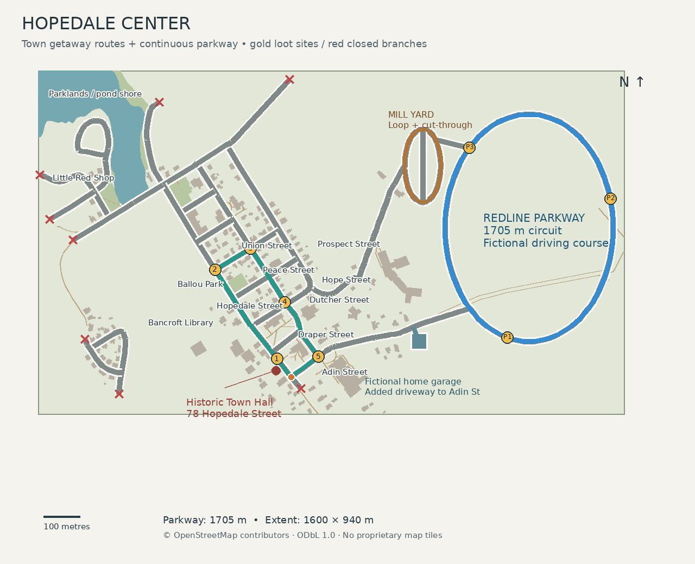
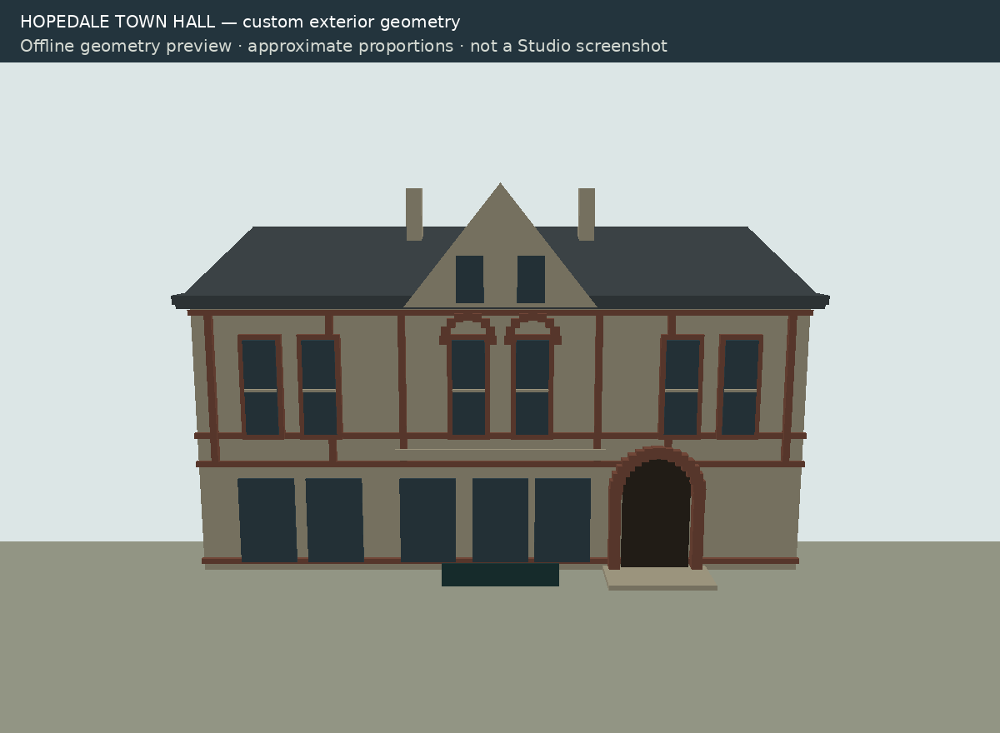

# Hopedale center — first driving slice

## Extent and provenance



The selected loop is **Hopedale Street → Union Street → Dutcher Street → Adin Street → Hopedale Street**, following shared OSM junction nodes. Its centerline length is **917.39 m**. The separate fictional home driveway connects to Adin east of that loop; drive west on Adin, turn right onto Hopedale, pass historic Town Hall, turn right at Union, right at Dutcher and right at Adin, then return east along Adin to the driveway. No teleports are required for this trip. Follow the verified map and street signs; orange loop signs are added gameplay navigation.

Local bounds are east **−650 to +420 m**, north **−120 to +820 m**, relative to historic Town Hall. Width/depth: **1,070 × 940 m**. Twenty-five source road ways and 192 building footprints are included; road ways can contain multiple junctions. Source extract bounds are larger than the build bounds. Closed town branches have visible barriers and warning signs. The Adin east endpoint now continues into an authored access road instead of a closure.

The **fictional Redline Parkway** extends playable terrain east to **+950 m** (total **1,600 × 940 m**). Its 96-segment oval is **1,705.48 m** long and **12 m** wide, with a clear verge, authored trees, signs and lamps. It connects to town through Parkway Access at the existing eastern Adin endpoint. This is game geography, not a claim that a real road exists there. The original town loop remains available for missions and escape routes.

The anchor is historic Town Hall at **78 Hopedale Street**, not the newer municipal office location at 54. See [source records and attribution](../geo/ATTRIBUTION.md). Town Hall is a custom exterior based on its mapped footprint and inspected front photograph. Nearby named civic/church/library footprints use generic shells, not detailed replicas.



This image is a software geometry preview, **not a Studio screenshot**. Roblox materials, text surfaces, shadows and lighting are not reproduced by it.

## Coordinate and elevation convention

Input WGS84 longitude/latitude is projected using PROJ/pyproj into **EPSG:26986, NAD83 / Massachusetts Mainland, metres**. Always use longitude first (`always_xy=True`). The local origin is OSM node 7241414065: **42.1289534, −71.5398681**, projected **196703.68929684727 E, 875393.0276178694 N**.

At the existing **0.28 m/stud** convention:

```text
Roblox X = (Easting − origin Easting) / 0.28
Roblox Y = 32 + local elevation metres / 0.28
Roblox Z = −(Northing − origin Northing) / 0.28
```

North is −Z and east is +X. The **32-stud datum is arbitrary**; it is not a surveyed elevation. Horizontal scale is uncompressed. The first neighborhood is intentionally flat: no DEM was imported, and actual local hills remain unrepresented. The Freedom Street bridge (way 1268960544) is explicitly curated with a flat continuous deck and stone parapets. Other tagged bridges/tunnels/separate road levels cause import failure. No surveyed bridge elevation is claimed.

Mapped town roads use a provisional **7.2 m paved width** and **1.7 m sidewalks**. Historic MassGIS-import `width` tags are retained but not assumed to measure current pavement. Road polygons are unioned and constrained-triangulated before export; exact triangle coverage is asserted. The garage floor footprint is cut out of terrain tiles and road/sidewalk surfacing, eliminating competing floor layers. Elsewhere decorative surfaces share a flat collision datum provided by ground tiles, so independently stacked road colliders cannot create launch seams. Sidewalk elevation/curbs are visual approximations; realistic curb climbing remains a lab test. Crosswalk locations come from tagged OSM crossings; paint dimensions are provisional.

## Offline generation and authoring

Install GIS dependencies once into the project, without replacing system packages:

```bash
python3 -m pip install --target .tools/gis -r scripts/gis-requirements.txt
```

The cached extract is included. Normal map generation needs **no network**:

```bash
bash scripts/project.sh map
bash scripts/project.sh map-test
bash scripts/project.sh check
```

`map` projects the cache, builds road/scenery geometry, executes the curated landmark/garage recipe, writes the runtime route module, and renders map/geometry previews. `build` packs the existing baked assets with source scripts; it does not redownload or rebake geography. `check` runs GIS tests against temporary outputs, leaving working generated files unchanged.

To explicitly refresh the OSM extract:

```bash
bash scripts/download-hopedale.sh
bash scripts/project.sh map
bash scripts/project.sh check
```

Review changed roads/footprints, source hash, proposed driveway and preview before accepting a refreshed snapshot. Some complete OSM ways extend beyond the request bbox; generation limits the built roads/footprints separately. Source timestamps and tags are retained. The fictional site is selected deterministically from clear candidates; a data refresh may require a curated site decision.

| Files | Purpose |
| --- | --- |
| `geo/source/hopedale.osm` | Cached original geographic extract, ODbL |
| `scripts/course_geometry.py` | Authored fictional parkway and access connection |
| `geo/curated/hopedale.json` | Origin, scale, extent, selected real route and provisional policies |
| `geo/curated/landmarks.py` | Hand-authored Town Hall and fictional garage recipe |
| `geo/generated/hopedale.json` | Projected nodes, buildings, lane graph, route, source hash and part count |
| `assets/generated/*.rbxmx` | Editor-visible baked map and curated models; overwrite on regeneration |
| `assets/handcrafted/` | Independent exported Studio models; never touched by generation |
| `src/shared/TownMap.luau` | Small generated runtime garage/route configuration |
| `docs/previews/` | Map and offline landmark geometry previews |

Do not hand-edit the generated road assets. Change the curated inputs/recipe, or export independent `.rbxmx` additions into `assets/handcrafted`. Regeneration tests check deterministic output and preservation of those inputs/additions.

## Garage and collection

The fictional workshop has three wide bays, overhead doors, a turning apron, direct driveway, interior lamps, workbench/tool storage, a lounge/planning corner and three anchored collection displays. Those displays are separate from active physics vehicles. They represent **Pickup**, **Electric sedan**, and **Sport coupe**; none claims a particular brand or trim.

Players spawn on foot. Walk to any collection selector, press E, then open the assigned bay's door with the adjacent wall button. The selected active vehicle replaces the static display in that player's reserved bay. One active vehicle per player is retained. A session has **three home bay reservations**, not twelve personal houses: a fourth player receives a clear capacity rejection. Visitors cannot operate an assigned bay's door. Reservations release on disconnect; bay assignments are temporary; garage progression is saved when a data store is available.

Server checks selection reach, stopped vehicle, cooldown, in-flight creation, occupied spawns and ownership. Closing doors check for cars/characters before movement and again before enabling collision. Door collision is disabled during movement; if an obstruction appears mid-close, the door reopens. Test this in Studio before relying on it.

Changing vehicles is allowed at home with the previous car stopped. Return normally, park, get out, and select another vehicle. **R** is exceptional recovery/repair to the reserved bay, not part of the normal driving loop.

## Vehicle handling and test modes

The existing suspension, input validation and lifecycle remain. Collection vehicles have different dimensions, density and acceleration/braking tuning. Visible wheel centers match suspension wheelbases. Wheel rotation follows forward speed; front wheels steer with the same angle used by the collection's bicycle-style yaw calculation. The bundled free Roblox collection models retain their imported wheel meshes; these are animated around authored wheel centres. The legacy Compact is a separate runtime import.

Collection dimensions and configured unboosted limits:

| Vehicle | Approx. width × length | Wheelbase | Speed limit | Turbo |
| --- | --- | --- | --- | --- |
| Pickup | 2.10 × 5.60 m | 3.24 m | 150 km/h | None |
| Electric | 1.96 × 4.76 m | 2.82 m | 180 km/h | None |
| Sport | 1.96 × 4.48 m | 2.43 m | 210 km/h | Optional +35 km/h |

Steering has no stationary pivoting, reverses correctly while backing up, and tapers with speed. These are handling configurations, not measured realism claims. Suspension uses the existing vertical raycasts; true tyre contact, unsprung mass and deformable damage are absent.

**V / Camera** switches cockpit/chase view. Chase is the initial view for easier geometry diagnosis. **G / Diagnostics** starts a fresh measurement session and shows sampled 0–50 km/h time, last braking distance and starting speed, steering angle, ground contacts and damage. Measurements are local driving observations, not certified performance data.

**M / Menu → HandlingLab**, while seated and stopped, moves to the preserved isolated test course at X≈−6000. **Autobahn** opens the existing night highway test mode. **R** returns home. Compact (imported asset 6810376207), Coupe and Interceptor remain selectable from the expanded menu at the garage.

Town collisions accumulate damage: below 12 km/h normal impact component causes no added damage; 12–35 adds 10%, 35–65 adds 30%, and 65+ adds 60%. At 100% propulsion is disabled until recovery. This is an approximate swept body collision model; it must be validated with physical impact tests. Autobahn traffic still uses its original explosion/replacement behavior. Player-to-player car collision remains disabled in both modes pending a separate pursuit/collision test.

## Lane graph and pursuit routing

The lane graph is independent of geometry, with right-hand offsets, travel direction, OSM one-way restrictions, junction connections, navigation points, tagged controls and explicit provisional stop/yield policy. The generated JSON retains this data. `RoadGraph.luau` supplies a compact directed graph with the garage driveway for current police and mission routing. Unfinished map exits have physical closures and warnings, with a perimeter fence around the district.

**AI getaway police now run during missions**, following the updated gameplay priority. Civilian traffic and two roaming officers now run on right-hand town, parkway and mill-loop paths. Light/Busy/Rush jobs select 6/12/18 civilian targets. See [progression](PROGRESSION.md). See [GETAWAY.md](GETAWAY.md) for pursuit rules and the required engine acceptance pass.

The quality update also adds the fictional Mill Service Loop, cut-through and Centennial/North Parkway Access, preserving two independent connections to the parkway. See the README for current gameplay.

## Studio acceptance — not yet run

1. Open the rebuilt place in edit mode. Inspect `HopedaleGenerated`, `HopedaleLandmarks/HistoricTownHall`, and `HomeBase`; they must already exist. Stop the old Play session and reopen `build/redline-county.rbxlx` after rebuilding. Press N for daylight: the avatar should appear in a clear aisle, with the collection visible and no wall/furniture filling the camera. Orbit and zoom while walking; reset the character and check the start again.
2. Walk around all three displays. Press E at the green selector beside Pickup (or click Pickup in the menu). Read the assigned bay number in the status message; the active car replaces that bay's display. Walk to that bay's wall switch and press E to open it. Return beside the active car: the prompt must say Drive, not Select vehicle; press E and leave slowly. Verify an opaque wall still blocks remote entry, and that the hidden display no longer blocks seating. Test Electric and Sport too. Record tyre/floor contact, roof/door clearance and whether cockpit visibility works with V. Confirm hands/tyres aren't mistaken for exact vehicle replicas.
3. Close a door with a car or avatar in its path; it must stay/reopen safely. In a three-client test, try taking another player's vehicle or door, selecting while moving, selecting repeatedly, and occupying a reserved spawn. A fourth client must receive an occupied/reservation message, never overwrite someone else's car.
4. Follow the map from the garage along Adin to Hopedale, north past Town Hall, right at Union, right at Dutcher and right at Adin. Return along Adin to the garage, park, exit and change vehicle. Check each intersection/crosswalk for gaps, snags or visual holes. No normal-trip teleport should occur.
5. In the isolated HandlingLab, enable G at rest. Record three 0–50 runs and three 50–0 stops for each vehicle; note start speed and distance. Initial acceptance targets: stable straight-line acceleration, repeatable stopping within 15%, no wheel lift at parking speeds, turning diameter roughly 10–15 m at walking pace, and no launches over driveway transitions/modest test curbs. These are targets; **no measured values are claimed yet**.
6. Tap a wall slowly, then test 20/50/70 km/h impacts. Minor contact should remain drivable, severe repeated impacts should disable propulsion, and R should repair only when the ownership/recovery conditions pass. Check Autobahn impacts still explode/recover separately.
7. Drive with two clients far apart. Inspect loading on turns, high-speed approaches, home recovery and test-mode transfers. Watch for missing road tiles, partial vehicles or invisible collision. Test lower graphics settings and a phone/emulator. Record frame time, memory and streaming stalls.

Budget: about **11,913 baked parts**, under a 12,000-part expanded-map ceiling, with small atomic road tiles/buildings; ambient vehicles are persistent to avoid streaming pop-out, simplified collision shells and 256/768-stud streaming minimum/target radii. Streaming is configured in the place file through supported properties. This is a design budget, **not a measured FPS or phone-performance result**. No separate distant impostor system exists yet; streaming removes distant detailed groups.

## Next boundary and remaining work

Prove this loop and refine elevations, curbs, facade fit and lane priorities before expanding. The cached source contains the southern Hopedale Street connection toward Mendon Street / MA 16; that is the next corridor to study for connections toward Milford and Mendon. It is not part of the current baked route. The expanded bake includes the southern pond shore, park paths, Ballou memorial, Little Red Shop and Bancroft Library. The pond is a visual surface over the provisional ground datum; swimming, depth and boating are not implemented.

Outstanding: actual terrain survey, exact facade details and signs, individual property drives/stone walls, stronger road-edge visual polish, hand animation, physics/streaming/multiplayer measurements, and per-player property instances. AI pursuit, differentiated jobs and a saved garage are implemented; unpublished files use local practice data. Player police roles, jail/arrest scenes and weapons remain outside scope. See [quality acceptance](QUALITY-ACCEPTANCE.md) for persistence and engine tests.

### Garage startup repair

The first user playtest showed an obstructed startup view and inaccessible cars. Arrival positions overlapped rear furniture, while collection selectors were isolated at the front of the displays. Arrival markers now live in clear aisles in the baked model; the server uses those same markers, and the client initializes its walking view after relocation. Walking zoom is capped at 8 studs near home and 24 outside. Side selectors replace their prompt with the active car's Drive prompt when their display is hidden. Hidden displays disable collision queries; entry tests solid obstructions from the character to the seat rather than relying on camera visibility. Roblox API references: [Player camera limits](https://create.roblox.com/docs/reference/engine/classes/Player#CameraMaxZoomDistance), [prompt visibility](https://create.roblox.com/docs/reference/engine/classes/ProximityPrompt#RequiresLineOfSight).

The offline regression probes the actual baked furniture/walls/displays for avatar and initial camera clearance at all three arrivals, plus direct walking access and prompt range to the selectors. Rendering, prompt arbitration, and seating still require the Studio steps above.
